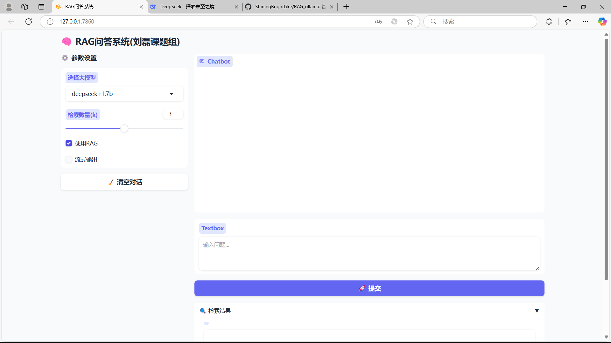

# RAG_ollama

基于大语言模型的本地知识库问答系统，多文件模块化实现的 RAG 系统，支持文档检索与生成式问答，保留文本来源信息。

## 项目结构

```
rag-system/
├── main.py                 # 主程序入口
├── RAGSystem.py            # RAG核心逻辑
├── FaissIndexBuild.py      # 索引构建模块
├── GradioDefine.py         # 交互界面实现
├── 本地知识库/              # 默认文档存储目录
│   ├── *.pdf/.txt/.docx/.pptx    # 支持多种文档格式
└── requirements.txt        # 依赖列表
```

## 快速开始

### 1. 环境配置

```bash
# 创建虚拟环境
python -m venv venv
source venv/bin/activate  # Linux/Mac
venv\Scripts\activate     # Windows

# 安装依赖
pip install -r requirements.txt
```

### 2. 部署大语言模型

```bash
# 安装Ollama（需先下载安装包）
# 官网：https://ollama.ai

# 拉取并运行模型（以deepseek-r1:7b为例）
ollama pull deepseek-r1:7b
ollama run deepseek-r1:7b  # 保持此终端运行

# 如需测试其他模型，可替换为：
# ollama run llama3
# ollama run qwen:7b
```

### 3. 准备知识库

将您的文档放入 `本地知识库` 文件夹，支持格式：
- PDF (.pdf)
- Word (.docx)
- 纯文本 (.txt)
- PPT (.pptx)
- Markdown (.md)

### 4. 运行系统

```bash
# 首次运行需要构建索引
python FaissIndexBuild.py

# 启动应用（自动打开浏览器界面）
python main.py
```

## 模块说明

### 1. FaissIndexBuild.py

- **功能**：文档处理与向量索引构建
- **核心方法**：
  ```python
  build_index(documents, index_path="index.faiss")
  # 构建FAISS索引并保存元数据
  
  load_index(index_path="index.faiss", metadata_path="metadata.json")
  # 加载已有索引
  ```

### 2. RAGSystem.py

- **核心类**：
  ```python
  class RAGSystem:
      def search(query: str, k=3) -> List[Dict]
      # 检索相似文本（返回包含来源的字典）
      
      def generate_response(query: str, stream=False) -> Generator
      # 生成带来源引用的回答
  ```

### 3. GradioDefine.py

- **界面特性**：
  - 实时流式输出
  - 检索结果显示来源文件
  - 支持多模型切换
  - 对话历史管理



## 常见问题

### Q1: 如何更换大模型？
1. 通过Ollama下载新模型：
   ```bash
   ollama pull <模型名>  # 例如：llama3、qwen:7b
   ```
2. 在Gradio界面下拉菜单选择新模型
3. 重启Ollama服务运行新模型

### Q2: 索引未更新怎么办？
删除索引文件后重建：
```bash
rm text_search_index.faiss index_metadata.json
python FaissIndexBuild.py
```

### Q3: 如何添加新文档？
1. 将文件放入`本地知识库`目录
2. 删除现有索引文件
3. 重新运行 `FaissIndexBuild.py`

### Q4: Ollama服务无法连接？
1. 检查Ollama是否正常运行：
   ```bash
   ollama list
   ```
2. 确保API端口(默认11434)未被占用
3. 在`main.py`中检查Ollama基地址配置：

   ```python
   ollama.base_url = 'http://localhost:11434'
   ```

## 参考项目
1. [Langchain-Chatchat](https://github.com/chatchat-space/Langchain-Chatchat)
2. [Ollama官方文档](https://github.com/ollama/ollama?tab=readme-ov-file)
3. [Gradio文档](https://www.gradio.app/docs/)
```
